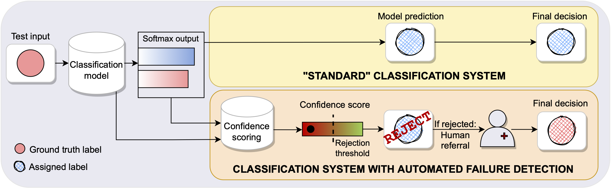

# Failure Detection in Medical Image Classification: A Reality Check and Benchmarking Testbed

This repository contains the code to reproduce all the experiments in the ["Failure Detection in Medical Image Classification: A Reality Check and Benchmarking Testbed"](https://openreview.net/pdf?id=VBHuLfnOMf) paper. 
In particular it allows benchmarking of 9 different confidence scoring methods, for 6 different medical imaging datasets. We provide all the necessary training, evaluation and plotting code to reproduce all the experiments in the paper. 

## Overview
The repository is divided into 5 main folders:
* `data_handling` contains all the code related to data loading and augmentations.
* `configs`: contains all the `.yml` configs for the experiments in the paper as well as helper functions to load modules and data from a given config. 
* `models` contains all the models architecture definition and [pytorch lightning](https://pytorch-lightning.readthedocs.io/en/latest/starter/introduction_guide.html) modules. 
* `classification` contains the main training script `train.py` as well as all the required files to run SWAG in the `classification/swag` subfolder (code taken [from the authors](https://github.com/wjmaddox/swa_gaussian)) and the files to run DUQ baseline in the `classification/duq` subfolder (code adapted [from the authors](https://github.com/y0ast/deterministic-uncertainty-quantification)).
* `failure_detection` contains all the code for the various confidence scores.
    * The implementations of each individual score is grouped in the `uncertainty_scores` folder. Note that the Laplace baseline is obtained with the [Laplace package](https://github.com/AlexImmer/Laplace), for TrustScore we used the code [from the authors](https://github.com/google/TrustScore). Similarly in the `ConfidNet` sub-subfolder you will find pytorch-lightning version of the code, adapted from the code of [the authors](https://github.com/valeoai/ConfidNet).
    * The main runner for evaluation is `run_evaluation.py` for which you need to provide the name of the config defining the model.
 * `paper_plotting_notebooks` notebooks to produce the plots summarzing the experiment results as in the paper. 

All the outputs will be placed in `{REPO_ROOT} / "outputs"` by default. 

## Prerequisites
1. Start by cloning our conda environment as specified by the `environment.yml` file as the root of the repository. 
2. Make sure you update the paths for the RSNA, the EyePACS and the BSUI datasets in [default_paths.py](default_paths.py) to point to the root folder of the dataset as downloaded from [Kaggle RSNA Pneumonia Detection Challenge](https://www.kaggle.com/c/rsna-pneumonia-detection-challenge) for RNSA, from [Kaggle EyePACS Challenge](https://www.kaggle.com/c/diabetic-retinopathy-detection) for EyePACS and from [this page](https://scholar.cu.edu.eg/?q=afahmy/pages/dataset) for BUSI. For the EyePACS dataset you will also need to download the [test labels](https://storage.googleapis.com/kaggle-forum-message-attachments/90528/2877/retinopathy_solution.csv) and place it at the root of the dataset repository.
3. Make sure the root directory is in your `PYTHONPATH` environment variable. 
Ready to go!

## Step-by-step example
In this section, we will walk you through all steps necessary to reproduce the experiments for OrganAMNIST and obtain the boxplots from the paper. The procedure is identical for all other experiments, you just need to change which yml config file you want to use (see next section for description of configs). 

Assuming your current work directory is the root of the repository:
1. Train the 5 classification models `python classification/train.py --config medmnist/organamnist_resnet_dropout_all_layers.yml`. Note if you just want to train one model you can specify a single seed in the config instead of 5 seeds.
2. If you want to have the SWAG results, additionally train 5 SWAG models `python classification/swag/train_swag.py --config medmnist/organamnist_resnet_dropout_all_layers.yml`
3. If you want to have the ConfidNet results also run `python failure_detection/uncertainty_scorer/confidNet/train.py --config medmnist/organamnist_resnet_dropout_all_layers.yml`
4. If you want to have the DUQ results also run `python classification/duq/train.py --config medmnist/organamnist_resnet_dropout_all_layers.yml`.
5. You are ready to run the evaluation benchmark with `python failure_detection/run_evaluation.py --config medmnist/organamnist_resnet_dropout_all_layers.yml`
6. The outputs can be found in the `outputs/{DATASET_NAME}/{MODEL_NAME}/{RUN_NAME}` folder. Individual results for each seed are placed in separate subfolders named by the corresponding training seed. More importantly, in the `failure_detection` subfolder of this output folder you will find:
    * `aggregated.csv` the aggregated tables with average and standard deviation over seeds. 
    * `ensemble_metrics.csv` with the metrics for the ensemble model.
7. If you then want to reproduce the boxplots figures from the paper, you can run the `paper_plotting_notebooks/aggregated_curves.ipynb` notebook. Note this will save the plot inside the `outputs/figures` folder.

## Configurations to reproduce all plots in the paper
In order to reproduce all plots in Figure 2 of the paper, you need to repeat all steps 1-7 for the following provided [configs](configs/):
* PathMNIST: [medmnist/pathmnist_resnet_dropout_all_layers.yml](configs/medmnist/pathmnist_resnet_dropout_all_layers.yml)
* OrganAMNIST: [medmnist/organamnist_resnet_dropout_all_layers.yml](configs/medmnist/organamnist_resnet_dropout_all_layers.yml)
* TissueMNIST: [medmnist/tissuemnist_resnet_dropout_all_layers.yml](configs/medmnist/tissuemnist_resnet_dropout_all_layers.yml)
* RSNA Pneumonia: [rsna/rsna_resnet50_dropout_all_layers.yml](configs/rsna/rsna_resnet50_dropout_all_layers.yml)
* BUSI Dataset: [BUSI/busi_resnet.yml](configs/BUSI/busi_resnet.yml)
* EyePACS Dataset: [EyePACS/retino_resnet.yml](EyePACS/retino_resnet.yml)

Just replace the config name by one of the above config names and follow the steps from the above section (note that config name argument is expected to be the relative path to the configs folder). 

## References
For this work, the following repositories were useful:
* [AlexImmer/Laplace](https://github.com/AlexImmer/Laplace)
* [google/TrustScore](https://github.com/google/TrustScore)
* [wjmaddox/swa_gaussian](https://github.com/wjmaddox/swa_gaussian)
* [valeoai/ConfidNet](https://github.com/valeoai/ConfidNet)
* [y0ast/deterministic-uncertainty-quantification](https://github.com/y0ast/deterministic-uncertainty-quantification)
* [PyTorchLightning/pytorch-lightning](https://github.com/PyTorchLightning/pytorch-lightning)
* [microsoft/InnerEye-DeepLearning/InnerEye-DataQuality](https://github.com/microsoft/InnerEye-DeepLearning/tree/main/InnerEye-DataQuality)
